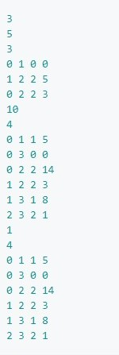
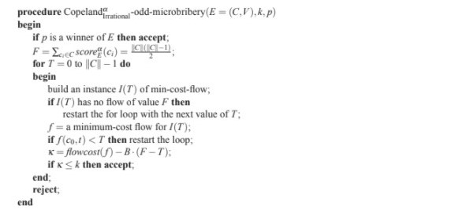
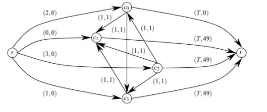

# Microbribery

Repository contains project of "Graph algorithms" course at AHG UST in Cracow. Algorithm solving microbribery problem implemented with c++.

## Problem description

King is organizing an chess tournament in order to win in. He introduced following rules. Every two players plays against. Winner is the player with most wins except draw, then king is the winner. Chess game isn't king's strong site so he need to cheat. King servants, based on previous analysis, know each duel result. They can bribe players to change result of single duel. Each bribery cost a specific amount of money. The point is to mineralize cost of briberies and let the king win.

More detailed description [here](https://faliszew.github.io/algograf/2020.project1)

## Input

The input file in the first line contains a T that tells how many tournament problems solve. The ist of lines contains tournament description in the following formats:

* B - tournament organizer's budget
* n - number of tournament participants. King has 0 number.
* In next _n*(n-1)/2_ lines there are four numbers x,y,w,b meaning x play against y, w player who wins, b cost of microbribery

Example:

## Output

Output file contains T lines

* _TAK_ - if king can afford bribery
* _NIE_ - else

## Sollution

Solved using modified maxflow mincost algorithm.

_Picture source :  Journal of Artificial Intelligence Research 35 (2009) 275-341 Llull and Copeland Voting Computationally Resist
Bribery and Constructive Control_
